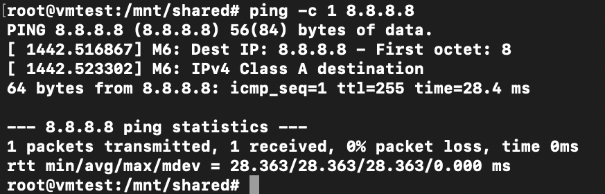
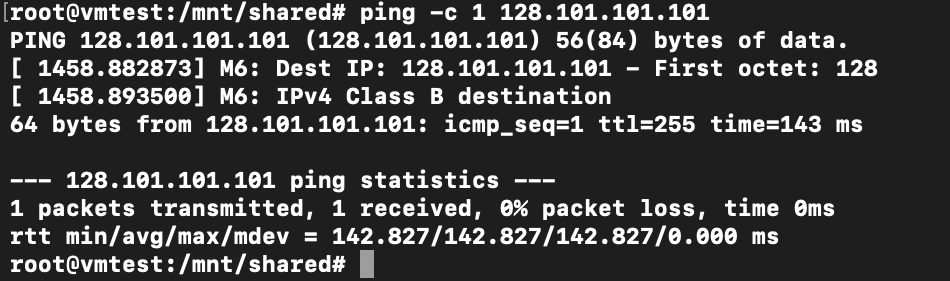
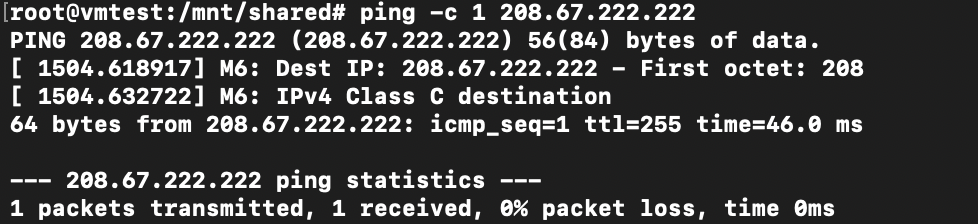
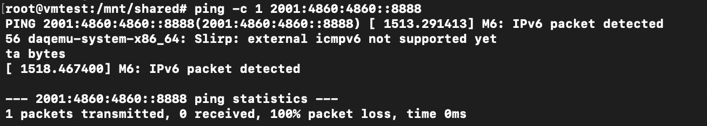
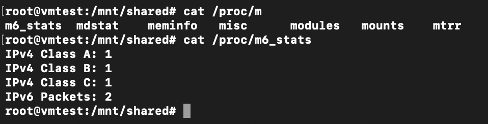
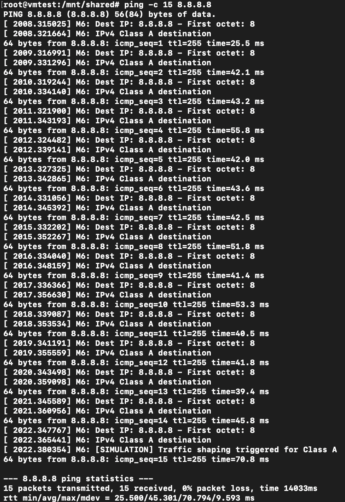

# Custom Kernel Module for Packet Classifier

This project demonstrates how to create a custom Linux kernel module designed to count TCP and UDP packets, and send a warning every 100 received TCP or UDP .

## Usage Instructions

The directory contains a `Makefile` with predefined targets to manage the build and installation process:

### Targets

- **build**: Compile the kernel module. This will generate a `.ko` file that can be loaded into the kernel.
  
- **install**: Copy the compiled `.ko` module into the shared folder accessible within your VM. This shared folder is linked via a symbolic link named `shared` in the current directory, allowing easy access from the Guest OS running in the VM.
  
- **clean**: Remove all build artifacts, including the `.ko` file, to clean up the directory for a fresh build.

## How to Use

1. **Build the module**

   ```bash
   make build
   ```

2. **Install the module**

   ```bash
   make install
   ```

3. **Clean build artifacts**

   ```bash
   make clean
   ```

## Mounting Instructions

For access in the VM

```bash
cd /kernel-playground/tests/vm
./run.sh
```

In the VM 

```bash
cd /mnt/shared
insmod m6_classifier.ko
```

In this way the module is loaded. 

## Testing

The classification of the packet is made using the first octect of the destinationa address.

ipv4 class A packet

```bash
ping -c 1 8.8.8.8
```


ipv4 class B packet

```bash
ping -c 1 128.101.101.101
```



ipv4 class C packet

```bash
ping -c 1 208.67.222.222
```


ipv6 packet

```bash
ping -c 1 2001:4860:4860::8888
```


The counting of the packet is made in background and is visible in the file m6_stats using the command:

```bash
cat /proc/m6_stats
```




Note: The presence of an extra packet in the IPv6 packet counter may be due to auxiliary IPv6 messages automatically generated by the network stack, such as Neighbor Solicitation (NS), Router Solicitation (RS), or other ICMPv6 packets indirectly triggered by the ping6 command. Although these are not echo request packets, they are still intercepted and counted by the module as valid IPv6 traffic.


for the traffic shaping the threshold choose are: 
- 15 for IPv4 class A
- 10 for IPv4 class B
- 7 for IPv4 class B
- 5 for IPv6 packet

using the same command showed before whith the adding of "-c 'number of packet'" is possible triggered the message of traffic shaping.

Example:

```bash
ping -c 15 8.8.8.8
```


Ensure that your environment has the necessary kernel headers and build tools installed to successfully compile the module.

---

*Note:* The actual kernel module source code should be in the `linux` directory, and the `Makefile` is configured to compile it accordingly.
